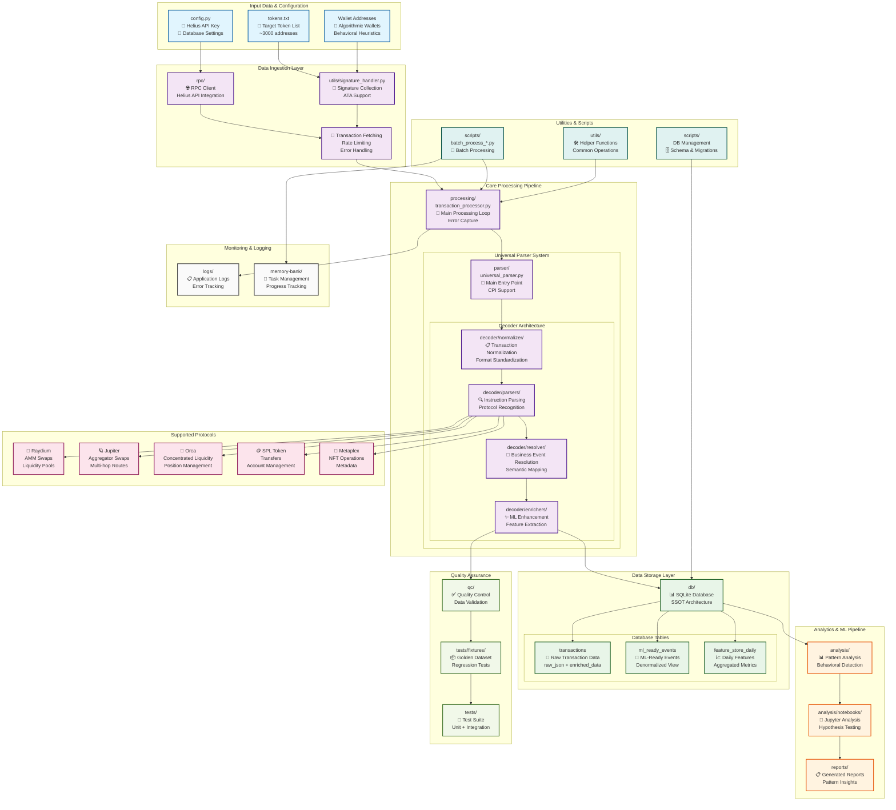
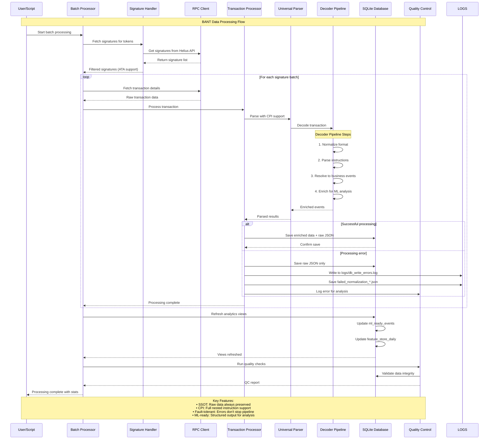
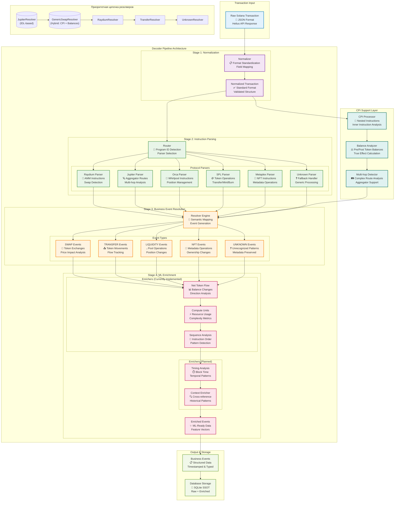

# Архитектурные диаграммы проекта BANT

Данный документ содержит подробные Mermaid диаграммы архитектуры проекта BANT (Behavioral Analysis of Network Transactions) для анализа поведенческих паттернов алгоритмических кошельков на блокчейне Solana.

## 1. Общая архитектура системы

Данная диаграмма показывает все основные компоненты системы и их взаимосвязи:

- **Входные данные**: конфигурация, список токенов, адреса кошельков
- **Слой получения данных**: RPC клиент, обработка сигнатур, поддержка ATA
- **Основной пайплайн обработки**: Universal Parser с поддержкой CPI
- **Архитектура декодера**: нормализация → парсинг → резолвинг → обогащение
- **Поддерживаемые протоколы**: Raydium, Jupiter, Orca, SPL Token, Metaplex
- **Слой хранения**: SQLite с SSOT архитектурой
- **Аналитика и ML**: обработка паттернов, Jupyter notebooks
- **QA и тестирование**: тесты, фикстуры, контроль качества

## 2. Последовательность обработки данных

Диаграмма последовательности показывает детальный поток выполнения операций в системе.

## 3. Детальная архитектура декодера

Данная диаграмма детализирует внутреннее устройство 4-этапного пайплайна декодера.

## Ключевые архитектурные принципы

### 1. Single Source of Truth (SSOT)
- Сырые данные транзакций всегда сохраняются в поле `raw_json`
- Обогащенные данные сохраняются в поле `enriched_data`
- Даже при ошибках обработки сырые данные остаются доступными

### 2. Отказоустойчивость
- Ошибки в одной части пайплайна не останавливают обработку других компонентов
- Неподдерживаемые инструкции маркируются как `UNKNOWN` с сохранением метаданных
- Система способна обрабатывать любые инструкции Solana

### 3. Поддержка CPI (Cross-Program Invocation)
- Полная обработка вложенных инструкций (inner instructions)
- Формирование семантических событий из сложных многоуровневых транзакций
- Анализ изменений токенов на основе preTokenBalances/postTokenBalances
- Поддержка мультихоп свапов через различные агрегаторы

### 4. ML-готовность
- Структурированный вывод данных для машинного обучения
- Нормализованные и дедуплицированные данные
- Подготовка признаков для анализа поведенческих паттернов
- Поддержка итеративного экспериментирования

### 5. Модульная архитектура
- Легко расширяемая система протоколов
- Четкое разделение ответственности между компонентами
- Независимые модули для парсинга, резолвинга и обогащения
- Поддержка добавления новых протоколов без изменения основной логики

### 6. Контроль качества
- Комплексная система тестирования (unit + integration)
- Golden Dataset для регрессионных тестов
- Автоматизированная валидация данных
- Мониторинг и логирование всех операций

## Описание архитектурных компонентов

### Входные данные и конфигурация
- **config.py**: Содержит настройки подключения к Helius API и параметры базы данных
- **tokens.txt**: Список целевых токенов для анализа (~3000 адресов)
- **Wallet Addresses**: Предварительно отобранные алгоритмические кошельки на основе поведенческих эвристик

### Слой получения данных (Data Ingestion Layer)
- **RPC Client**: Интеграция с Helius API для получения данных блокчейна
- **Signature Handler**: Сбор сигнатур транзакций с поддержкой Associated Token Accounts (ATA)
- **Transaction Fetching**: Получение полных данных транзакций с обработкой ошибок и лимитами скорости

### Основной пайплайн обработки (Core Processing Pipeline)
- **Transaction Processor**: Главный цикл обработки с захватом ошибок
- **Universal Parser**: Центральный оркестратор обработки с поддержкой CPI, использующий decoder как библиотеку инструментов
- **Decoder Architecture**: 4-этапный пайплайн декодирования (библиотека модулей)

### Поддерживаемые протоколы
- **Raydium**: AMM свапы и пулы ликвидности
- **Jupiter**: Агрегатор свапов и мультихоп маршруты
- **Orca**: Концентрированная ликвидность и управление позициями
- **SPL Token**: Трансферы и управление аккаунтами
- **Metaplex**: NFT операции и метаданные

### Слой хранения данных (Data Storage Layer)
- **SQLite Database**: SSOT архитектура с портативностью
- **transactions**: Таблица с сырыми и обогащенными данными
- **ml_ready_events**: Денормализованное представление для ML
- **feature_store_daily**: Агрегированные метрики по дням

### Аналитика и ML пайплайн
- **Pattern Analysis**: Обнаружение поведенческих паттернов
- **Jupyter Notebooks**: Интерактивный анализ и тестирование гипотез
- **Generated Reports**: Структурированные отчеты по найденным паттернам

## Технические особенности

### Decoder Pipeline (4 этапа)
1. **Нормализация**: Стандартизация формата транзакций
2. **Парсинг**: Распознавание инструкций по протоколам
3. **Резолвинг**: Преобразование в бизнес-события
4. **Обогащение**: Добавление ML-признаков

### CPI Support Layer
- **CPI Processor**: Анализ вложенных инструкций
- **Balance Analyzer**: Расчет истинного эффекта на основе балансов
- **Multi-hop Detector**: Обнаружение сложных маршрутов

### Обогатители (Enrichers)
**Реализованные:**
- **NetTokenChangeEnricher**: Анализ изменений токенов
- **ComputeUnitEnricher**: Метрики использования ресурсов
- **SequenceEnricher**: Анализ последовательности инструкций

**Планируемые к реализации:**
- **TimingEnricher**: Анализ временных паттернов
- **ContextEnricher**: Контекстное обогащение с исторической перекрестной ссылкой

### Типы событий
- **SWAP**: Обмены токенов с анализом ценового воздействия
- **TRANSFER**: Движения токенов с отслеживанием потоков
- **LIQUIDITY**: Операции с пулами и изменения позиций
- **NFT**: Операции с метаданными и изменения владения
- **UNKNOWN**: Нераспознанные паттерны с сохранением метаданных

## Заключение

Данная архитектура обеспечивает надежную, масштабируемую и расширяемую систему для анализа поведенческих паттернов алгоритмических кошельков на блокчейне Solana. 

Основные преимущества:
- **Отказоустойчивость**: Система продолжает работать даже при ошибках
- **Расширяемость**: Легко добавлять новые протоколы и типы анализа
- **ML-готовность**: Данные подготовлены для машинного обучения
- **Прозрачность**: Полное логирование и отслеживание операций
- **Портативность**: SQLite обеспечивает простоту развертывания 