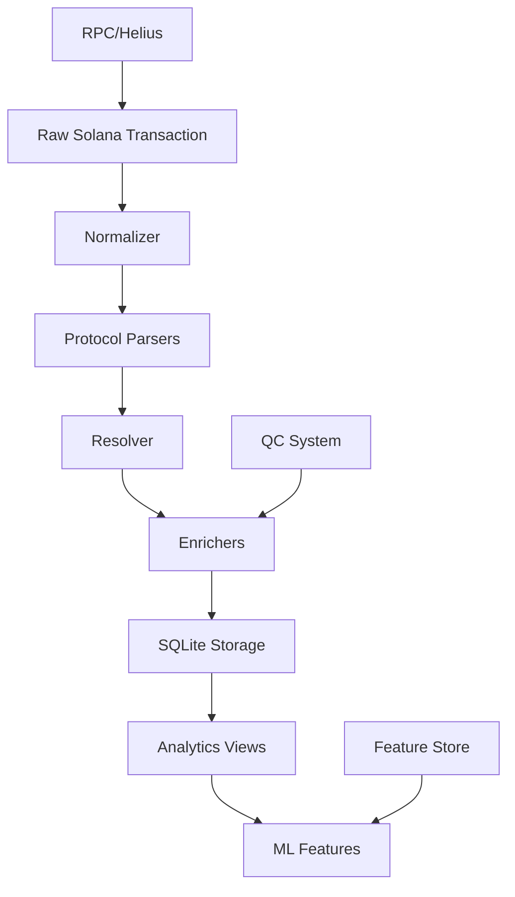

# BANT: Система Анализа Поведения Алгоритмических Кошельков
черный плац
**BANT** — это комплексный data pipeline, предназначенный для сбора, обработки и анализа транзакционных данных с блокчейна Solana. Основная цель проекта — выявление поведенческих паттернов алгоритмических кошельков, которые могут служить предикторами резких изменений цен на токены (дампов).

## Общая архитектура проекта

Система построена по модульному принципу, где каждый компонент выполняет свою четко определенную роль — от сбора сырых данных до их анализа и визуализации.

```mermaid
graph TD
    subgraph "Источник данных"
        A[Блокчейн Solana] --> B(RPC/Helius API);
    end

    subgraph "Основной конвейер обработки"
        C(scripts) --> D(test_pipeline.py);
        B --> D;
        D --> E(decoder);
        E --> F(services);
        F --> G(db_writer.py);
        G --> H[База данных (SQLite)];
    end

    subgraph "Анализ и Визуализация"
        H --> I(analysis);
        I --> J(reports);
        J --> K(ft - Дашборд);
    end

    subgraph "Вспомогательные модули"
        L(config)
        M(utils)
        N(tests)
    end

    style D fill:#bbf,stroke:#333,stroke-width:2px
    style E fill:#f9f,stroke:#333,stroke-width:2px
    style K fill:#FFD700,stroke:#333,stroke-width:2px
```

## Описание ключевых модулей и директорий

### Основные компоненты

- **`decoder/`**: **[ПОДРОБНАЯ ДОКУМЕНТАЦИЯ](./decoder/README.md)**. Ядро системы. Превращает сырые JSON-транзакции в структурированные, обогащенные события, готовые к анализу.
- **`services/`**: Набор сервисов, которые используют `decoder` для выполнения конкретных задач (например, сервис для обработки транзакций по списку кошельков).
- **`db/`**: Содержит все, что связано с базой данных, включая миграции (`migrations`) и, возможно, модели данных.
- **`db_writer.py`**: Скрипт, отвечающий за запись обработанных и обогащенных данных из конвейера в базу данных.
- **`analysis/`**: Модули для анализа данных, уже сохраненных в БД. Здесь могут находиться стратегии бэктестинга, jupyter-ноутбуки для исследований и скрипты для генерации отчетов.
- **`scripts/`**: Коллекция различных вспомогательных скриптов для автоматизации задач, например, для запуска полного цикла обработки данных.
- **`test_pipeline.py`**: Главный демонстрационный и тестовый файл. Он показывает, как все компоненты (`decoder`, `services`, `db_writer`) работают вместе для выполнения сквозной обработки одной или нескольких транзакций.

### Визуализация и отчеты

- **`ft/`**: Фронтенд-приложение (вероятно, Next.js/React), представляющее собой дашборд для визуализации результатов анализа.
- **`reports/`**: Директория для сгенерированных отчетов (например, в форматах .csv, .html, .pdf).

### Вспомогательные директории

- **`config/`** и **`configs/`**: Хранилища конфигурационных файлов для различных модулей системы (например, параметры подключения, списки токенов, настройки триггеров).
- **`data/`**: Место для хранения статических данных, например, списков кошельков для анализа.
- **`logs/`**: Директория для лог-файлов, которые помогают в отладке и мониторинге работы системы.
- **`tests/`**: Набор модульных и интеграционных тестов для обеспечения надежности кода.
- **`utils/`**: Набор вспомогательных функций и утилит, которые используются в разных частях проекта.
- **`pyproject.toml`** и **`requirements.txt`**: Файлы, управляющие зависимостями проекта и его сборкой.
- **`.bat` файлы**: Скрипты для удобного запуска и остановки дашборда в среде Windows.

## 🎯 Цель проекта

Создание комплексной системы для:
- **Анализа поведенческих паттернов** алгоритмических кошельков перед ценовыми падениями
- **Детекции триггерных сигналов** предвещающих обвал цены токенов
- **Подготовки ML-ready датасетов** для машинного обучения и гипотез-тестирования
- **Мониторинга событий ликвидности** как ключевых индикаторов активности

## 🏗️ Архитектура системы



### Ключевые компоненты:

- **`/decoder`** - Автономный модуль декодирования транзакций (Normalize → Parse → Resolve → Enrich)
- **`/rpc`** - Клиенты для работы с Solana RPC и Helius API
- **`/analysis`** - Модули аналитики, детекции паттернов и feature engineering
- **`/processing`** - Оркестрация обработки транзакций и batch-операций
- **`/db`** - Управление SQLite базой данных и миграциями
- **`/qc`** - Система контроля качества данных и валидации
- **`/scripts`** - Утилиты для batch-обработки и администрирования
- **`/tests`** - Комплексное тестирование всех компонентов
- **`/memory-bank`** - Документация задач и архивирование решений

## 🚀 Быстрый старт

### Требования
- Python 3.10+
- SQLite 3.36+
- Helius API Key (для Solana RPC)

### Установка
```bash
# Клонирование репозитория
git clone <repository-url>
cd bant

# Установка зависимостей
pip install -r requirements.txt

# Настройка конфигурации
cp config/config.py.example config/config.py
# Укажите HELIUS_API_KEY в config/config.py
```

### Базовое использование

```bash
# Полная обработка всех токенов
python scripts/batch_process_all_tokens.py

# Обработка конкретных токенов
python scripts/batch_process_transactions_sqlite.py --token_file data/custom_tokens.txt

# Создание аналитических витрин
python scripts/refresh_analytics_views_sqlite.py --refresh
python scripts/build_feature_store_sqlite.py --all

# Проверка качества данных
python qc/run_batch_validation.py
```

## 📊 Ключевые возможности

### 1. Event-Based Enrichment
- Каждая инструкция транзакции преобразуется в структурированные события `EnrichedEvent`
- Поддержка сложных CPI (Cross-Program Invocation) транзакций
- ML-ready форматы данных с автоматической нормализацией

### 2. Протокольная поддержка
- **DEX**: Raydium AMM V4, Jupiter V2-V6, Orca
- **Token Programs**: SPL Token, System Program
- **NFT/Meme**: Pump.fun, Metaplex
- **Расширяемая архитектура** для новых протоколов

### 3. Детекция событий ликвидности
- Автоматическое обнаружение создания пулов ликвидности
- Отслеживание изменений в пулах как триггеров
- Анализ поведения initial liquidity providers

### 4. Feature Engineering
- Временные признаки (time_to_first_pool, активность по периодам)
- Сетевые признаки (связи между кошельками, координация действий)
- Ликвидные признаки (объемы, изменения пулов, price impact)
- Поведенческие признаки (паттерны свопов, timing analysis)

### 5. Quality Control (QC)
- Автоматическая валидация качества данных
- QC-теги для каждого события
- Сравнение с эталонными источниками (Solscan)
- Детекция аномалий и пропусков в данных

### 6. Глубокий анализ транзакций
- Система не просто читает логи, а разбирает транзакции до уровня инструкций, включая внутренние вызовы (CPI), что позволяет отслеживать сложные операции через несколько протоколов.
- Гибкая система резолверов
- Обогащение данных

## 📈 Текущий статус проекта

### ✅ Завершено (Phase 1)
- **Архитектурный рефакторинг**: Полная интеграция decoder модуля
- **Парсеры протоколов**: System, SPL Token, Raydium, Jupiter, Pump.fun
- **SQLite инфраструктура**: Миграции, индексы, аналитические витрины
- **Events ликвидности**: Детекция создания пулов Raydium AMM V4
- **QC система**: Автоматическая валидация и контроль качества

### 🚧 В работе (Phase 2)
- **Feature Engineering**: Реализация ключевых признаков для ML
- **ML Integration**: Подготовка датасетов для гипотез-тестирования
- **Расширение DEX**: Поддержка Orca и OpenBook протоколов
- **Advanced Analytics**: Корреляционный анализ и детекция паттернов

### 📋 Планируется (Phase 3)
- **Real-time мониторинг**: Live отслеживание событий ликвидности
- **ML модели**: Классификация и предсказание dump-триггеров
- **Dashboard**: Web-интерфейс для визуализации и анализа
- **API**: REST API для внешней интеграции

## 🔬 Исследовательские гипотезы

1. **Test Transaction Hypothesis**: Существуют ли "тестовые транзакции" перед основными дампами?
2. **Liquidity Pool Triggers**: Является ли момент создания пула триггером для координированной активности?
3. **Wallet Coordination**: Есть ли синхронизация действий между алгоритмическими кошельками?
4. **Volume Anomalies**: Предшествуют ли дампам аномальные изменения в объемах торгов?

## 📚 Документация

- **[PROJECT_DOC.md](PROJECT_DOC.md)** - Подробная техническая документация
- **[ARCHITECTURE.md](ARCHITECTURE.md)** - Архитектурные решения и паттерны
- **[/decoder/README.md](decoder/README.md)** - Документация модуля декодирования
- **[/analysis/README.md](analysis/README.md)** - Аналитические модули и паттерны
- **[/memory-bank/](memory-bank/)** - Архив задач и решений проекта

## 🧪 Тестирование

```bash
# Запуск всех тестов
pytest

# Тестирование конкретных модулей
pytest tests/decoder/
pytest tests/analysis/
pytest tests/qc/

# Регрессионные тесты
pytest tests/regression/
```

## 🤝 Участие в разработке

1. **Добавление нового протокола**:
   - Создать парсер в `/decoder/parsers/`
   - Добавить резолвер в `/decoder/resolver/resolvers/`
   - Написать тесты в `/tests/decoder/`

2. **Создание новых признаков**:
   - Расширить `/analysis/feature_library.py`
   - Добавить в feature store через `/scripts/build_feature_store_sqlite.py`

3. **QC и валидация**:
   - Добавить новые проверки в `/qc/checks.py`
   - Создать фикстуры в `/tests/fixtures/`

## 🎓 Глоссарий

- **EnrichedEvent** - Структурированное событие, полученное из инструкции транзакции
- **Feature Store** - Хранилище вычисленных ML-признаков
- **Liquidity Pool Events** - События создания/изменения пулов ликвидности
- **QC Tags** - Метки качества данных для валидации и аудита
- **Dump Trigger** - Сигнал или событие, предвещающее падение цены токена

## 📄 Лицензия

MIT License - см. [LICENSE](LICENSE) для деталей.

---

**Проект находится в активной разработке. Для вопросов и предложений используйте Issues на GitHub.**
