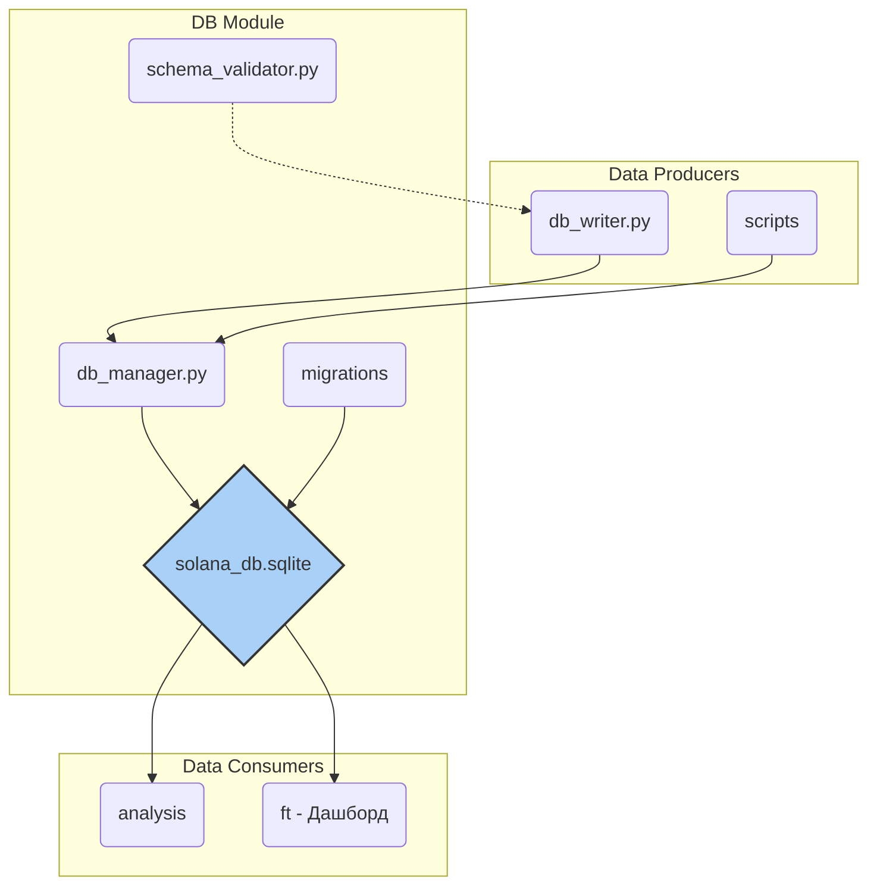

# DB (Модуль Базы Данных)

## Назначение

Эта директория — центральное хранилище данных всего проекта. Здесь находится вся логика для взаимодействия с базой данных (в данном случае, SQLite), а также сам файл базы данных. Модуль отвечает за создание, управление и запись данных в БД, обеспечивая их целостность и доступность для последующего анализа.

## Структура



## Файлы и директории

### `solana_db.sqlite`
- **Назначение**: Основной файл базы данных.
- **Роль**: Это "сердце" хранилища. В этом файле физически хранятся все собранные и обработанные данные: транзакции, события, изменения балансов и результаты обогащения.

### `db_manager.py`
- **Назначение**: Менеджер соединений с БД.
- **Роль**: Предоставляет централизованный способ для подключения к базе данных. Он управляет "сессиями" и "соединениями", гарантируя, что другие части программы (например, `db_writer` или модули анализа) могут безопасно читать и писать данные, не создавая конфликтов.

### `db_writer.py`
- **Назначение**: Главный компонент для записи данных.
- **Роль**: Этот скрипт принимает на вход обработанные данные от `decoder` и `services` и аккуратно записывает их в базу данных в соответствии с её структурой.

### `migrations/`
- **Назначение**: Управление версиями схемы БД.
- **Роль**: В этой папке лежат скрипты для миграций (вероятно, с использованием инструмента вроде Alembic). Если нам нужно изменить структуру таблиц в базе данных (добавить колонку, создать новую таблицу), мы не делаем это вручную. Вместо этого мы создаем новый скрипт миграции, который автоматически и безопасно применит изменения.

### `schema_validator.py`
- **Назначение**: Валидатор данных перед записью.
- **Роль**: Прежде чем записать данные в БД, этот модуль проверяет, соответствуют ли они ожидаемой схеме. Это дополнительный слой защиты, который предотвращает попадание "грязных" или некорректных данных в базу.

## Архитектура и ключевые файлы/папки
- `db_manager.py` — Инициализация пула соединений, получение/освобождение соединений, проверка существующих сигнатур, context manager для транзакций
- `db_writer.py` — Высокоуровневая запись транзакций, enrichment, wallet_links, batch-операции, логика обработки ошибок
- `db_ops.py` — Upsert discovered_pools, wallet_links, token_timeline, вспомогательные операции
- `schema_validator.py` — Проверка схемы БД на соответствие эталону, генерация отчётов и логов
- `migrations/` — SQL- и Python-скрипты для создания и изменения структуры таблиц (см. примеры ниже)

## Пример использования
```python
from db.db_manager import initialize_connection_pool, get_connection, release_connection
from db.db_writer import save_parsed_transaction

initialize_connection_pool()
conn = get_connection()
try:
    save_parsed_transaction(conn, tx_data, ...)
    conn.commit()
finally:
    release_connection(conn)
```

## Пример запуска миграции
```bash
python db/migrations/001_create_discovered_pools.py
```

## Best practices
- Все операции с БД через отдельные функции, поддержка транзакций и batch-записи
- Используйте schema_validator.py для контроля схемы БД при обновлениях
- Для новых таблиц и полей добавляйте миграции в папку migrations/
- Логируйте ошибки и используйте context manager для транзакций

## Ограничения
- Требует настроенного файла config/config.py с параметрами подключения
- Не реализует автоматический rollback при всех ошибках — используйте try/except
- Для production рекомендуется расширить тесты и добавить мониторинг состояния пула 