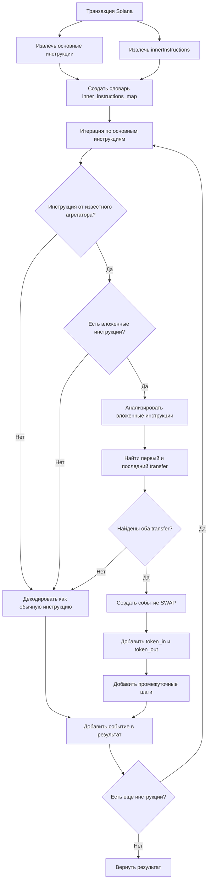

# Анализ структуры Cross-Program Invocation (CPI) в транзакциях Solana

## Введение

В рамках задачи по улучшению обработки сложных транзакций был проведен анализ структуры Cross-Program Invocation (CPI) в транзакциях Solana. Цель анализа - понять, как Solana представляет вложенные вызовы в JSON-RPC ответе и как можно программно восстановить цепочку вызовов для корректного декодирования сложных транзакций, таких как мультихоп-свопы.

## Анализ транзакции мультихоп-свопа

Для анализа была использована транзакция с сигнатурой `2S9wtoK2dYtnbPzrT3nXjsxzuMPRGNKVvMt9iT8nQomdMnVK8aTbtbzaybZ7HBVrBVHbv4MQvGtFmZ2Kudjc9ucK`, которая представляет собой "Proxy Swap через кастомный роутер (AG22uR) на Raydium V4".

### Структура транзакции

Транзакция содержит:
- 7 основных инструкций
- 2 группы innerInstructions
- 22 аккаунта (accountKeys)

### Основные инструкции

```
Инструкция 0: Программа ComputeBudget111111111111111111111111111111, Данные: KRiKnX
Инструкция 1: Программа ComputeBudget111111111111111111111111111111, Данные: 3EXnmfvmjd...
Инструкция 2: Программа 11111111111111111111111111111111, Данные: B2Upxc9qrN...
Инструкция 3: Программа TokenkegQfeZyiNwAJbNbGKPFXCWuBvf9Ss623VQ5DA, Данные: 2
Инструкция 4: Программа ATokenGPvbdGVxr1b2hvZbsiqW5xWH25efTNsLJA8knL, Данные:
Инструкция 5: Программа AG22uRpgfYjeLbLBGdJtHM6siWT7zZKiTkZTojNMCkfg, Данные: 6fguc2814t...
Инструкция 6: Программа TokenkegQfeZyiNwAJbNbGKPFXCWuBvf9Ss623VQ5DA, Данные: A
```

### Группы innerInstructions

#### Группа 1
- Индекс родительской инструкции: 4
- Родительская программа: ATokenGPvbdGVxr1b2hvZbsiqW5xWH25efTNsLJA8knL (Associated Token Account Program)
- Количество вложенных инструкций: 4
- Распределение программ во вложенных инструкциях:
  - TokenkegQfeZyiNwAJbNbGKPFXCWuBvf9Ss623VQ5DA (Token Program): 3
  - 11111111111111111111111111111111 (System Program): 1

#### Группа 2
- Индекс родительской инструкции: 5
- Родительская программа: AG22uRpgfYjeLbLBGdJtHM6siWT7zZKiTkZTojNMCkfg (Кастомный роутер)
- Количество вложенных инструкций: 5
- Распределение программ во вложенных инструкциях:
  - TokenkegQfeZyiNwAJbNbGKPFXCWuBvf9Ss623VQ5DA (Token Program): 3
  - Неизвестные программы: 2

### Изменения балансов токенов

В результате транзакции произошли следующие изменения балансов токенов:

1. Владелец: AkTgH1uW6J6j6QHmFNGzZuZwwXaHQsPCpHUriED28tRj
   - Токен: AL2HhMQLkJqeeK5w4akoogzyYBZ6GYkBfxjscCf2L2yC
   - Изменение: +500565

2. Владелец: 5Q544fKrFoe6tsEbD7S8EmxGTJYAKtTVhAW5Q5pge4j1
   - Токен: AL2HhMQLkJqeeK5w4akoogzyYBZ6GYkBfxjscCf2L2yC
   - Изменение: +166354744

3. Владелец: 5Q544fKrFoe6tsEbD7S8EmxGTJYAKtTVhAW5Q5pge4j1
   - Токен: So11111111111111111111111111111111111111112 (Wrapped SOL)
   - Изменение: -2197473

4. Владелец: GnRzpADfqYgUpAGo59BRMD2NnyKb85Gmhpy7wEfukQTA
   - Токен: AL2HhMQLkJqeeK5w4akoogzyYBZ6GYkBfxjscCf2L2yC
   - Изменение: -166855309

### Определение типа транзакции

На основе анализа изменений балансов токенов можно определить, что данная транзакция является SWAP операцией:
- Token In: So11111111111111111111111111111111111111112 (Wrapped SOL)
- Token Out: AL2HhMQLkJqeeK5w4akoogzyYBZ6GYkBfxjscCf2L2yC

## Структура innerInstructions в JSON-RPC ответе

В JSON-RPC ответе Solana, innerInstructions представлены в виде массива объектов в поле `meta.innerInstructions`. Каждый объект в этом массиве представляет группу вложенных инструкций и имеет следующую структуру:

```json
{
  "index": N,  // Индекс родительской инструкции в массиве transaction.message.instructions
  "instructions": [
    // Массив вложенных инструкций, каждая имеет структуру аналогичную основным инструкциям
    {
      "programIdIndex": M,  // Индекс программы в массиве accountKeys
      "accounts": [...],    // Массив индексов аккаунтов в массиве accountKeys
      "data": "..."         // Данные инструкции в base58
    },
    // ... другие вложенные инструкции
  ]
}
```

## Выводы и рекомендации для реализации

На основе проведенного анализа можно сделать следующие выводы:

1. **Структура вложенности**: Поле `index` в объекте innerInstructions указывает на индекс родительской инструкции в массиве `transaction.message.instructions`. Это ключевая связь, которая позволяет восстановить иерархию вызовов.

2. **Восстановление семантики**: Для корректного декодирования сложных транзакций, таких как мультихоп-свопы, необходимо:
   - Итерироваться по основным инструкциям
   - Для каждой инструкции проверять, есть ли у нее вложенные инструкции (по полю `index` в innerInstructions)
   - Если инструкция принадлежит известному агрегатору (например, Jupiter или кастомному роутеру), анализировать ее вложенные инструкции для определения фактического типа операции

3. **Алгоритм для реализации**:
   ```python
   def decode_transaction(tx_data):
       instructions = tx_data['transaction']['message']['instructions']
       inner_instructions_groups = tx_data['meta']['innerInstructions']
       
       # Создаем словарь для быстрого доступа к вложенным инструкциям по индексу родительской инструкции
       inner_instructions_map = {group['index']: group['instructions'] for group in inner_instructions_groups}
       
       events = []
       
       for i, instruction in enumerate(instructions):
           program_id = get_program_id(instruction, tx_data)
           
           # Если это инструкция агрегатора и у нее есть вложенные инструкции
           if is_aggregator(program_id) and i in inner_instructions_map:
               # Анализируем вложенные инструкции для определения типа операции
               inner_instrs = inner_instructions_map[i]
               
               # Ищем первый и последний transfer для определения token_in и token_out
               first_transfer = find_first_transfer(inner_instrs, tx_data)
               last_transfer = find_last_transfer(inner_instrs, tx_data)
               
               if first_transfer and last_transfer:
                   # Создаем событие SWAP
                   events.append({
                       'type': 'SWAP',
                       'token_in': get_token_from_transfer(first_transfer, tx_data),
                       'token_out': get_token_from_transfer(last_transfer, tx_data),
                       'amount_in': get_amount_from_transfer(first_transfer),
                       'amount_out': get_amount_from_transfer(last_transfer),
                       'intermediate_steps': extract_intermediate_steps(inner_instrs, tx_data)
                   })
                   continue
           
           # Если это не агрегатор или не удалось определить SWAP, обрабатываем как обычную инструкцию
           event = decode_instruction(instruction, tx_data)
           if event:
               events.append(event)
       
       return events
   ```

### Блок-схема алгоритма



4. **Защита от бесконечной рекурсии**: Для предотвращения зацикливания на аномальных транзакциях рекомендуется:
   - Установить максимальную глубину анализа вложенных инструкций
   - Использовать итеративный подход вместо рекурсивного
   - Добавить таймаут для обработки одной транзакции

5. **Оптимизация производительности**:
   - Создать словарь для быстрого доступа к вложенным инструкциям по индексу родительской инструкции
   - Кэшировать результаты декодирования часто встречающихся шаблонов инструкций
   - Использовать параллельную обработку для независимых групп инструкций

## Заключение

Анализ структуры Cross-Program Invocation в транзакциях Solana показал, что для корректного декодирования сложных транзакций необходимо учитывать иерархическую структуру вложенных вызовов. Предложенный алгоритм позволит восстанавливать семантическую связь между инструкциями и объединять несколько технических событий в одно осмысленное бизнес-событие, что значительно повысит качество данных для ML-анализа. 