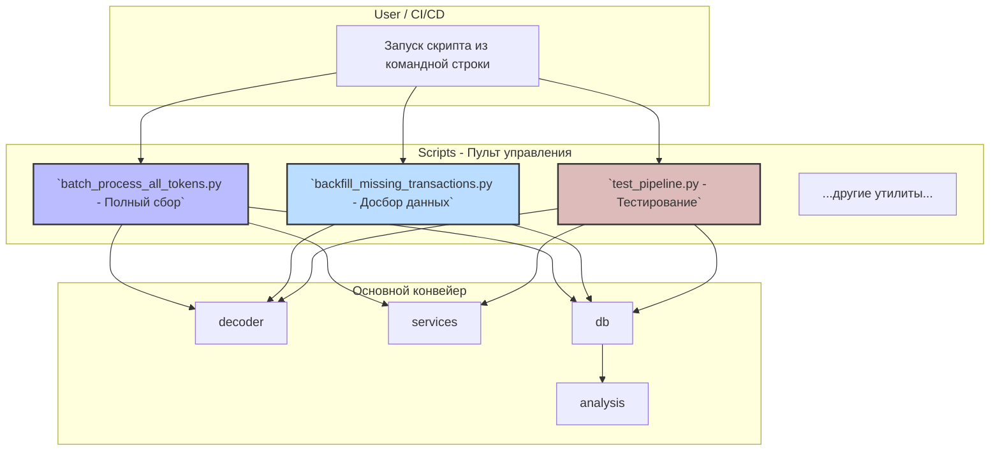

# Scripts (Скрипты)

## Назначение

Эта директория — **"пульт управления"** всем проектом. Здесь находятся исполняемые скрипты, которые запускают различные конвейеры и утилиты. Если `decoder`, `services`, `db` — это "органы" системы, то скрипты в этой папке — это "нервные импульсы", которые заставляют их работать вместе для достижения конкретной цели.

Именно из этой директории пользователь или автоматизированная система (CI/CD) будет запускать основные процессы.

## Структура и взаимодействие



## Ключевые скрипты

### `batch_process_all_tokens.py`
- **Назначение**: **Основной скрипт для полного сбора данных.**
- **Что делает**:
    1. Читает список токенов из `tokens.txt`.
    2. Последовательно обрабатывает каждый токен, загружая всю историю его транзакций.
    3. Для каждой транзакции запускает полный пайплайн: `decoder` -> `services` -> `db_writer`.
    4. После обработки каждого токена запускает дополнительный анализ для определения ролей кошельков (создатель, дампер).
    5. Периодически обновляет аналитические витрины и хранилище признаков.
- **Когда использовать**: Для регулярного, полного обновления базы данных.

### `backfill_missing_transactions.py`
- **Назначение**: **Инструмент для обеспечения полноты данных.**
- **Что делает**:
    1. Проверяет, для каких токенов в базе данных хранится неполная история транзакций (меньше определенного порога).
    2. Для этих токенов принудительно загружает **всю** историю транзакций с самого начала.
- **Когда использовать**: После первоначальной "быстрой" загрузки или для периодической проверки и восполнения пробелов в данных.

### `batch_process_transactions_sqlite.py`
- **Назначение**: **Модуль-библиотека, а не исполняемый скрипт.**
- **Что делает**: Предоставляет основные функции-"движки" (`process_token_batch`, `process_transaction_signatures`), которые используются другими скриптами (`batch_process_all_tokens.py`, `backfill_missing_transactions.py`). Он инкапсулирует логику получения и сохранения транзакций.
- **Когда использовать**: Не запускать напрямую. Использовать его функции в других скриптах.

### `test_pipeline.py` и `debug_single_tx.py`
- **Назначение**: **Инструменты для отладки и тестирования.**
- **Что делает**: Позволяют запустить весь конвейер обработки на одной или нескольких конкретных транзакциях и посмотреть результат. Это критически важно для разработки и отладки парсеров и обогатителей.
- **Когда использовать**: Во время разработки, при добавлении поддержки новых протоколов или при анализе проблемной транзакции.

## 🎯 Назначение

Данный модуль содержит исполняемые скрипты для:
- **Batch-обработки транзакций** токенов и кошельков
- **Управления базой данных** и миграций
- **Построения аналитических витрин** и feature store
- **Администрирования системы** и мониторинга
- **Утилит разработки** и отладки

## 📂 Структура и ключевые скрипты

### Batch-обработка транзакций
- **`batch_process_all_tokens.py`** - Полная обработка всех токенов из tokens.txt
- **`batch_process_transactions_sqlite.py`** - Обработка конкретных токенов через SQLite
- **`backfill_missing_transactions.py`** - Дозагрузка пропущенных транзакций
- **`quick_completeness_check.py`** - Быстрая проверка полноты данных
- **`verify_data_completeness.py`** - Детальная верификация полноты данных

### Управление базой данных
- **`migrate_all.py`** - Выполнение всех миграций БД
- **`check_db_structure.py`** - Проверка структуры и целостности БД
- **`check_db_schema.py`** - Валидация схемы БД
- **`clear_transactions_table.py`** - Очистка таблицы транзакций
- **`clear_all_transactions.py`** - Полная очистка всех данных

### Аналитические витрины и Feature Store
- **`refresh_analytics_views_sqlite.py`** - Обновление аналитических представлений
- **`build_feature_store_sqlite.py`** - Построение feature store для ML
- **`build_feature_store_sqlite_production.py`** - Production версия feature store
- **`refresh_analytics_views_fixed.py`** - Исправленная версия обновления витрин

### Системное администрирование
- **`cleanup_project.py`** - Очистка временных файлов проекта
- **`monitor_pipeline_health.py`** - Мониторинг здоровья пайплайна
- **`update_documentation.py`** - Автоматическое обновление документации
- **`check_file_encodings.py`** / **`fix_file_encodings.py`** - Работа с кодировками файлов

### Интеграция и миграция
- **`integrate_decoder.py`** - Интеграция нового decoder модуля
- **`migrate_files_to_db.py`** - Миграция данных из файлов в БД
- **`integrate_sol_analysis.py`** - Интеграция SOL торгового анализа

### Разработка и отладка
- **`debug_parser_logic.py`** - Отладка логики парсера
- **`show_transaction.py`** - Детальный просмотр транзакции
- **`manage_fixtures.py`** - Управление тестовыми фикстурами
- **`analyze_dependencies.py`** - Анализ зависимостей проекта

## 🚀 Примеры использования

### Полная обработка данных
```bash
# Обработка всех токенов (основной workflow)
python scripts/batch_process_all_tokens.py --workers 4 --signatures-limit 1000

# Обработка с возобновлением с определенного токена
python scripts/batch_process_all_tokens.py --resume-from [TOKEN_ADDRESS]

# Проверка полноты данных после обработки
python scripts/verify_data_completeness.py
```

### Работа с аналитическими витринами
```bash
# Создание ml_ready_events витрины
python scripts/refresh_analytics_views_sqlite.py --create

# Обновление существующих витрин
python scripts/refresh_analytics_views_sqlite.py --refresh

# Построение feature store для ML
python scripts/build_feature_store_sqlite.py --all --days 30
```

### Администрирование БД
```bash
# Проверка структуры БД
python scripts/check_db_structure.py

# Выполнение миграций
python scripts/migrate_all.py

# Очистка для повторной обработки
python scripts/clear_transactions_table.py
```

### Мониторинг и диагностика
```bash
# Мониторинг здоровья пайплайна
python scripts/monitor_pipeline_health.py

# Отладка конкретной транзакции
python scripts/show_transaction.py [SIGNATURE]

# Проверка полноты данных
python scripts/quick_completeness_check.py
```

## ⚙️ Параметры и конфигурация

Большинство скриптов поддерживают следующие общие параметры:

### Общие параметры
- `--workers N` - Количество параллельных воркеров
- `--batch-size N` - Размер батча для обработки
- `--signatures-limit N` - Лимит транзакций на токен
- `--token_file FILE` - Путь к файлу с токенами
- `--resume-from ADDRESS` - Возобновление с определенного токена

### Feature Store параметры
- `--all` - Обработка всех токенов
- `--days N` - Количество дней для анализа
- `--recalculate` - Пересчет существующих признаков

### БД параметры
- `--create` - Создание новых структур
- `--refresh` - Обновление существующих
- `--validate` - Валидация без изменений

## 🔧 Разработка и расширение

### Создание нового скрипта
1. Создайте файл в `/scripts/` с говорящим именем
2. Добавьте стандартный argparse для параметров
3. Используйте логгирование из `utils/logging`
4. Следуйте паттерну обработки ошибок существующих скриптов

### Стандартная структура скрипта
```python
import argparse
import logging
from pathlib import Path

def main():
    parser = argparse.ArgumentParser(description="Описание скрипта")
    parser.add_argument("--param", help="Описание параметра")
    args = parser.parse_args()
    
    logging.basicConfig(level=logging.INFO)
    logger = logging.getLogger(__name__)
    
    try:
        # Основная логика скрипта
        pass
    except Exception as e:
        logger.error(f"Ошибка выполнения: {e}")
        return 1
    
    return 0

if __name__ == "__main__":
    exit(main())
```

## 📊 Мониторинг и логирование

Все скрипты логируют свою работу в:
- **Консоль** - для интерактивного мониторинга
- **Файлы логов** - для постанализа и аудита
- **БД метрики** - для долгосрочного мониторинга

### Типичные метрики
- Время выполнения скрипта
- Количество обработанных записей
- Количество ошибок и их типы
- Использование ресурсов (память, CPU)

## 🚨 Важные примечания

### Безопасность
- Никогда не коммитьте API ключи в скрипты
- Используйте переменные окружения для конфиденциальных данных
- Валидируйте входные параметры перед обработкой

### Производительность
- Используйте параллельную обработку для больших датасетов
- Мониторьте использование памяти при batch-операциях
- Реализуйте checkpoints для длительных процессов

### Отказоустойчивость
- Все критические скрипты поддерживают возобновление работы
- Ошибки в одном элементе не останавливают всю обработку
- Ведется детальное логирование для диагностики проблем

## 📝 Логи и отчетность

Скрипты создают структурированные логи в `/logs/` с информацией о:
- Времени выполнения и прогрессе
- Количестве обработанных записей
- Ошибках и предупреждениях
- Статистике производительности

Для анализа логов используйте утилиты в `/monitoring/` или стандартные инструменты анализа текста. 